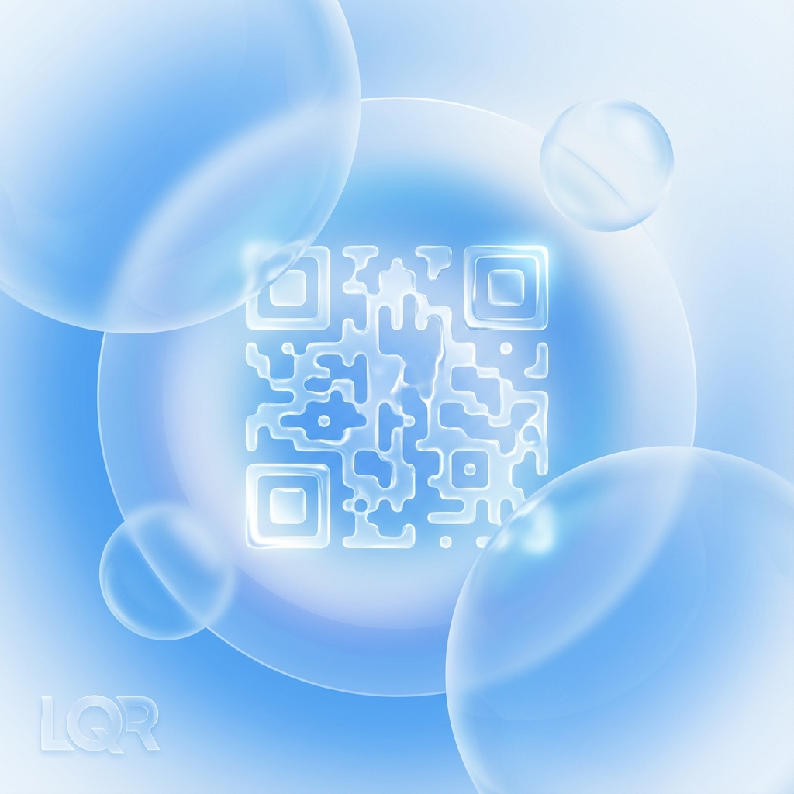

# Liquid QR Coder v1.0



> **"Generate stylish QR codes easily and intuitively for anyone." / "누구나 쉽고 간편하게, 스타일리시한 QR 코드를 생성하세요."**

Liquid QR Coder is a powerful C++ based QR code generator featuring a modern **Liquid Glassmorphism** design. QR codes appear in real-time on a beautiful interface as you type.

This project was created through a collaboration between **Rheehose (Rhee Creative)** and **Google DeepMind's Gemini 2.0 Flash (Antigravity)**.

---

## 📸 Screenshot / 스크린샷


---

## 🌟 Key Features / 주요 기능

- **Real-time Generation / 실시간 생성**: QR codes update instantly as you type. / 입력과 동시에 QR 코드가 즉각적으로 업데이트됩니다.
- **Premium Design / 프리미엄 디자인**: 60FPS animated liquid background and glassmorphism UI. / 60FPS 애니메이션 액체 배경과 유리 질감의 UI 요소.
- **Custom Title Bar / 커스텀 타이틀바**: Unique title bar matching the app theme. / 앱 테마와 어우러지는 독자적인 타이틀바 제공.
- **Bilingual Support / 다국어 지원**: Switch freely between English and Korean. / 한국어와 영어를 자유롭게 전환할 수 있습니다.
- **High Quality / 고품질**: Clean QR codes for easy scanning. / 스캔이 용이한 깨끗한 품질의 QR 코드를 생성합니다.

---

## 📦 Installation & Execution / 설치 및 실행 가이드

### 🐧 Linux (Debian/Ubuntu)
The easiest way is to use the provided **.deb** package. / 가장 쉬운 방법은 제공된 **.deb** 패키지를 사용하는 것입니다.
1.  Download `liquidqr_1.0_amd64.deb`.
2.  Run the following command: / 아래 명령어를 실행하세요:
    ```bash
    sudo dpkg -i liquidqr_1.0_amd64.deb
    ```
3.  Find "Liquid QR Coder" in your application menu! / 애플리케이션 메뉴에서 "Liquid QR Coder"를 찾아 실행하세요!

### 🍎 macOS
1.  Install Qt6 and CMake via Homebrew: / Homebrew를 통해 Qt6와 CMake를 설치하세요:
    ```bash
    brew install qt@6 cmake
    ```
2.  Run the provided script: / 제공된 스크립트를 실행하세요:
    ```bash
    ./run_macos.sh
    ```

### 🪟 Windows
1.  Install **Qt 6** and **CMake**. Ensure they are added to your System PATH. / **Qt 6**와 **CMake**를 설치하고 시스템 PATH에 추가하세요.
2.  Double-click `run_windows.bat`. / `run_windows.bat` 파일을 더블 클릭하세요.

---

## 🛠 Detailed Build Instructions / 상세 빌드 방법
If you prefer to build manually / 수동으로 빌드하고 싶은 경우:
```bash
# 1. Create build directory / 빌드 디렉토리 생성
mkdir build && cd build

# 2. Configure project / 프로젝트 설정
cmake ..

# 3. Build / 빌드
cmake --build .

# 4. Run / 실행
./appLiquidQR (Linux/Mac) or appLiquidQR.exe (Windows)
```

---

## 🛠 Technology Stack / 기술 스택
- **Language**: C++17
- **Framework**: Qt 6.4+ (QtWidgets)
- **Library**: Nayuki QR Code Generator
- **Build System**: CMake

## 📝 License / 라이선스
Distributed under the **MIT License**. / 이 프로젝트는 **MIT 라이선스**에 따라 배포됩니다. See [LICENSE](LICENSE) for details.

## 👤 Credits / 제작자
- **Rheehose (Rhee Creative)**
- **Gemini 2.0 Flash (Antigravity)**
- Copyright (c) 2008-2026 Rheehose (Rhee Creative)

---

*Last Updated: January 8, 2026 (KST)*
